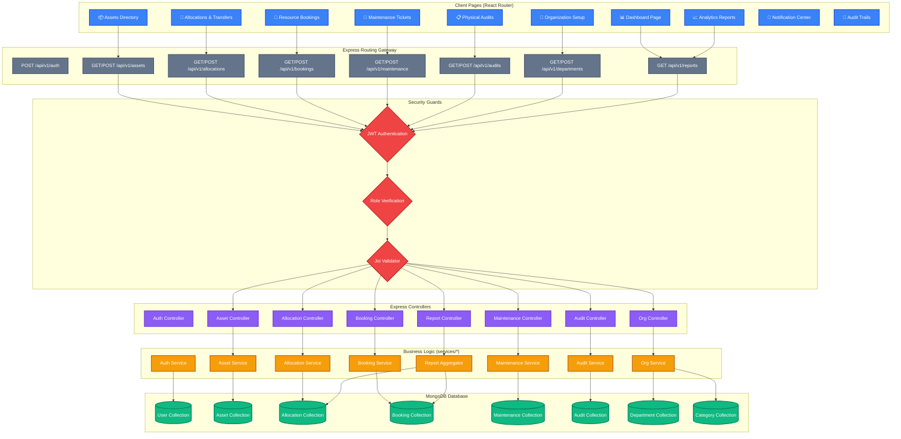
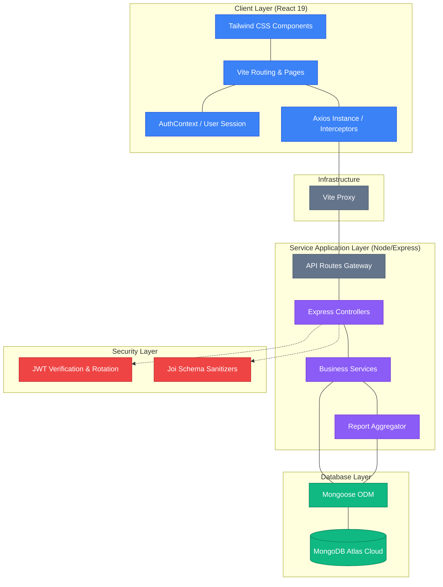
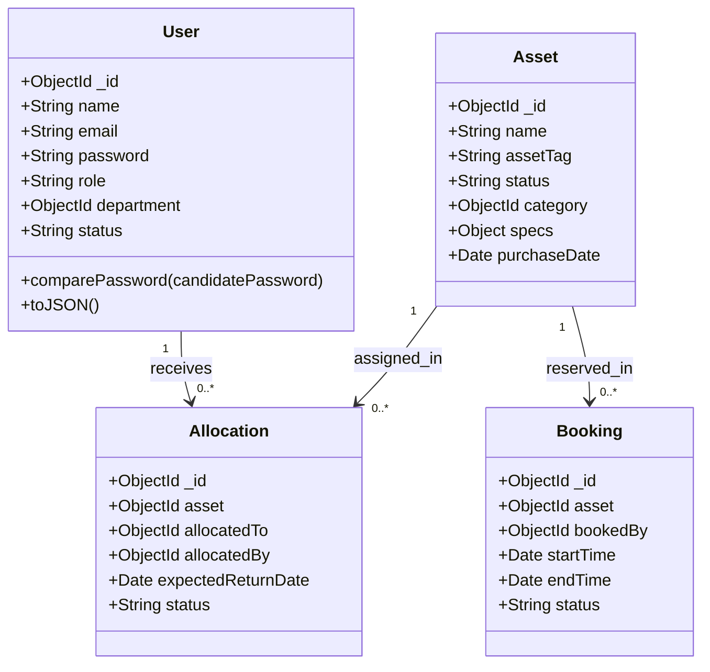
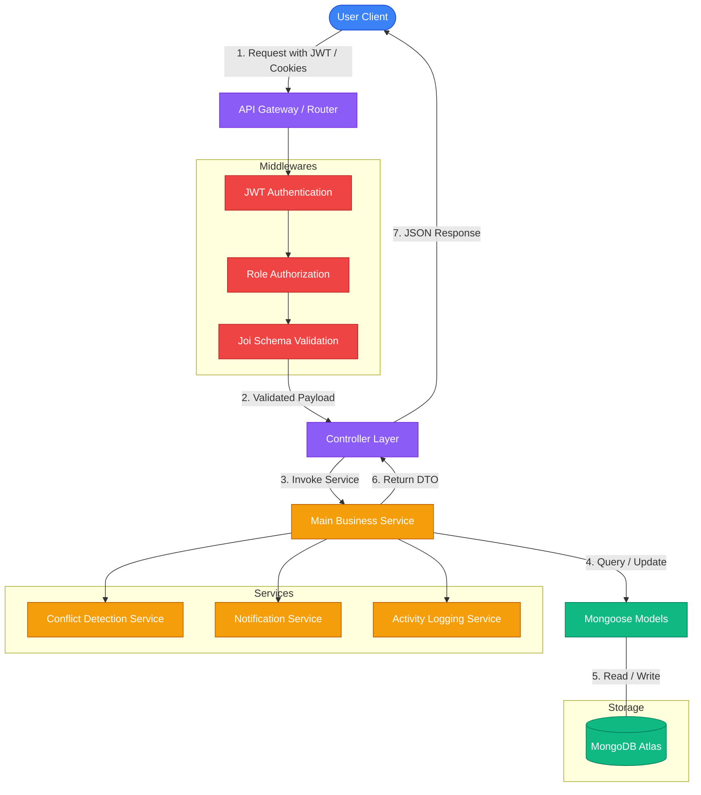
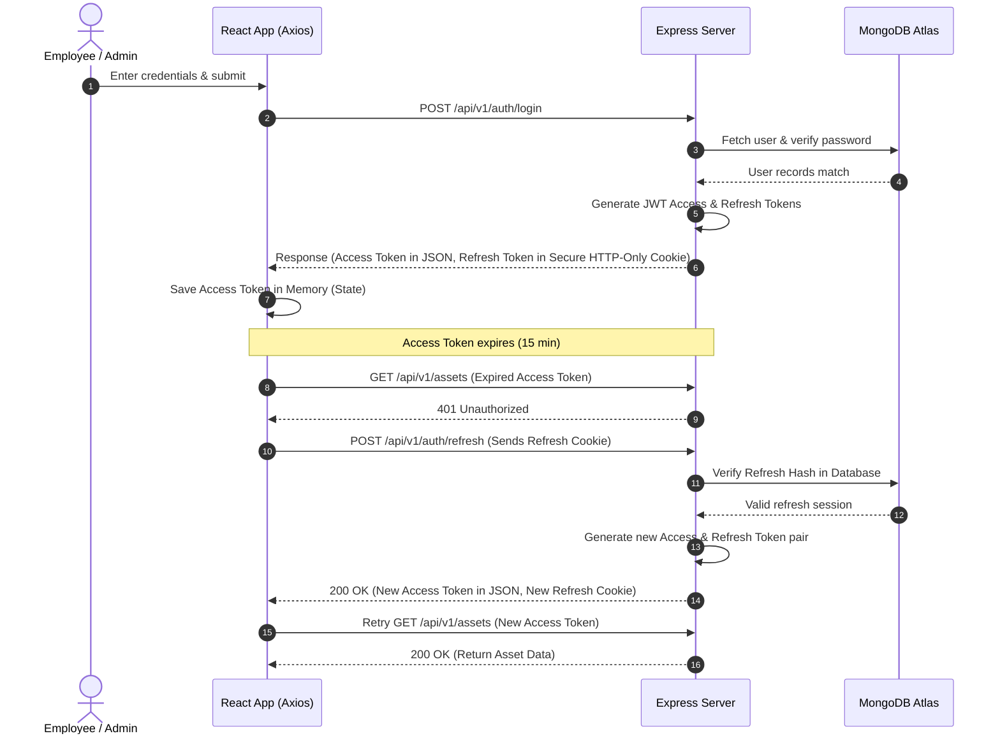

# 🚀 AssetFlow

### 🏢 Enterprise Asset & Resource Management System

AssetFlow is a modern, cross-industry Enterprise Resource Planning (ERP) platform designed to digitize and manage the end-to-end lifecycle of an organization’s physical assets and shared resources. It replaces outdated spreadsheets with a robust, real-time tracking pipeline for asset registrations, allocations, transfer conflict resolutions, resource bookings, maintenance operations, and physical audits.

---

## 🛠️ Technology Stack & Badges

| Architecture Layer | Technologies | Badges |
| :--- | :--- | :--- |
| **Frontend UI/UX** | React 19, Vite, Tailwind CSS, Framer Motion |     |
| **Backend Services** | Node.js, Express, Joi Schema Validator |    |
| **Database & ODM** | MongoDB Atlas Cloud, Mongoose ODM |   |
| **Security & Auth** | JWT Authentication, Bcrypt Password Salting |   |
| **Network Client** | Axios HTTP Request Client with Token Rotation Interceptors |  |

---

## 📐 System Modules & Component Flow

The master workflow below maps every user page, backend route, middleware gate, controller handler, service module, and MongoDB collection in a colorful representation.



---

## 📐 Architecture & System Design

### 1. High-Level Design (HLD)

The HLD below represents the clean segregation of client-side components, request mediation, app services, security interceptors, and database systems.



---

### 2. Low-Level Design (LLD)

The system enforces a **Three-Layer Architecture** (Routes ➔ Controllers ➔ Services ➔ Models). The diagram below models the schema structures and relationships between primary database entities.



---

### 3. Data Flow Diagram (DFD)

The data flow diagram depicts the journey of a client request as it gets authorized, sanitized, routed through controllers to service layers, queried in MongoDB, and broadcasted to log and notification adapters.



---

### 4. Authentication Flow (JWT Token Rotation & Invalidation)

AssetFlow balances security and UX via **JWT Token Rotation**. Access tokens are short-lived, while refresh tokens are hashed in MongoDB. The sequence below demonstrates login, request authorization, automatic silent token refreshing, and token rotation security checks.



---

## 🚀 Installation & Setup

### Prerequisites
* ⚙️ Node.js (v18+)
* 📦 npm (v10+)
* 🗄️ A MongoDB Atlas Cluster

### Step 1: Clone and Install Dependencies

```bash
# 1. Clone the repository
git clone https://github.com/Pranavdotexe/HelloWorld.git
cd HelloWorld

# 2. Install backend dependencies
cd backend
npm install

# 3. Install frontend dependencies
cd ../frontend
npm install
```

### Step 2: Configure Environment Variables
Create a `.env` file in the `backend/` directory:
```ini
NODE_ENV=development
PORT=5000
MONGODB_URI=mongodb+srv://<username>:<password>@cluster0.xxxx.mongodb.net/assetflow?retryWrites=true&w=majority
JWT_ACCESS_SECRET=your_access_secret_key_here
JWT_REFRESH_SECRET=your_refresh_secret_key_here
JWT_ACCESS_EXPIRY=15m
JWT_REFRESH_EXPIRY=7d
CORS_ORIGIN=http://localhost:5173
BCRYPT_SALT_ROUNDS=12
```

### Step 3: Run the Application

#### 1. Start the Backend Server (Terminal 1)
```bash
cd backend
npm run dev
```

#### 2. Start the Frontend Client (Terminal 2)
```bash
cd frontend
npm run dev
```

Open **[http://localhost:5173](http://localhost:5173)** in your browser. 

---

## 🔒 Security Hardening
* 🛡️ **NoSQL Injection Protection:** Queries use structured object attributes instead of raw inputs to prevent query manipulation.
* 🔑 **Token Rotation:** Old refresh tokens are invalidated upon use. If a reuse attack is detected, all refresh sessions for the compromised user are instantly revoked.
* 🍪 **HTTP-Only Cookies:** Prevents XSS attacks from accessing the session tokens.
